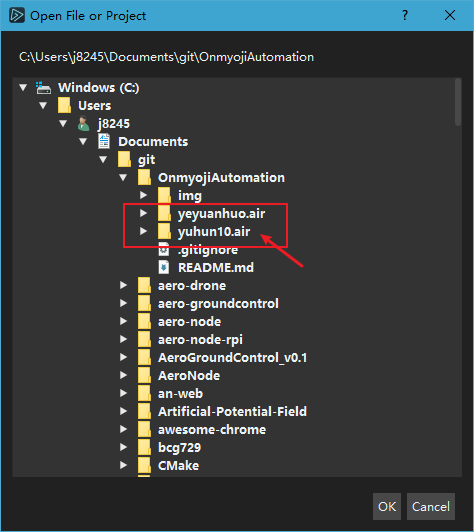
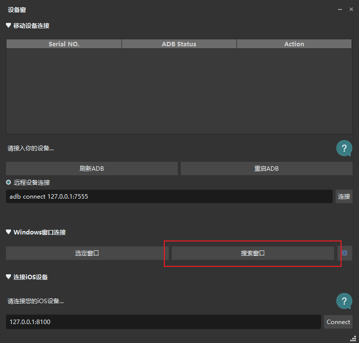
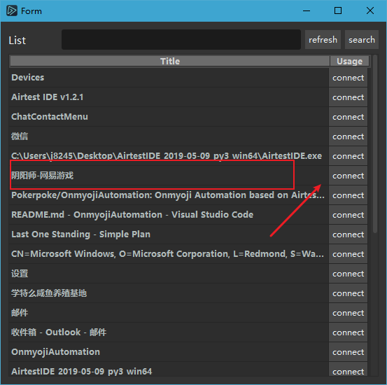
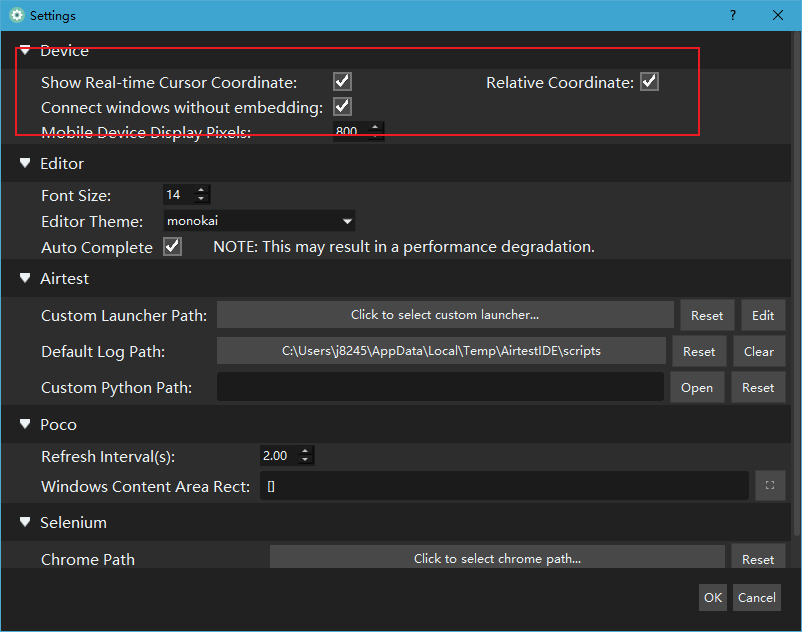
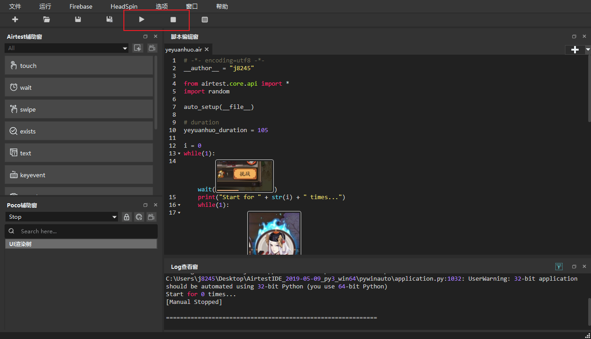

# Onmyoji Automation

## 依赖

- [Airtest](https://github.com/AirtestProject/Airtest)

[下载地址](http://airtest.netease.com/)，下载完成后以**管理员权限**打开即可。

## 使用方法

文件->打开脚本，选择对应以`.air`结尾的文件夹即可。

连接游戏窗口。

选项->设置，勾选如下选项。

执行脚本

### 1.魂十

在如下界面使用

### 2.业原火

在如下界面使用

