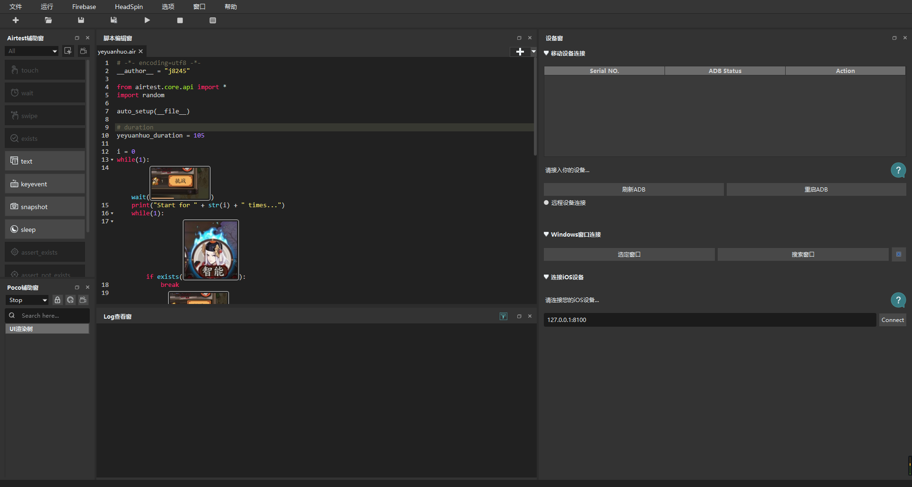
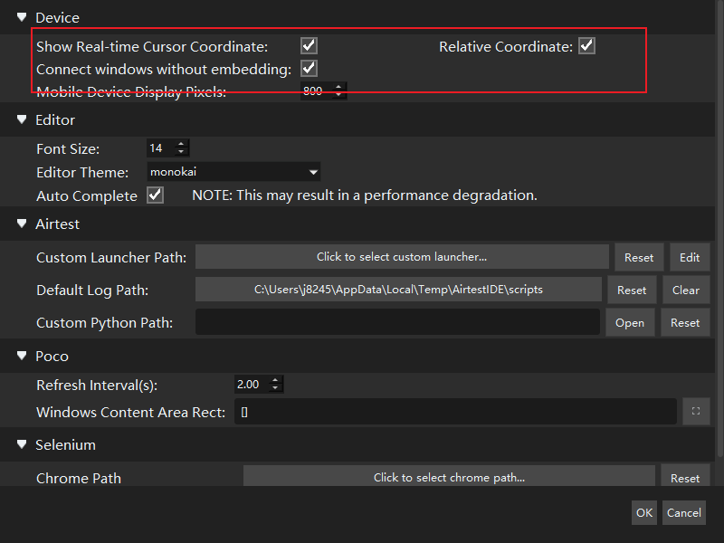
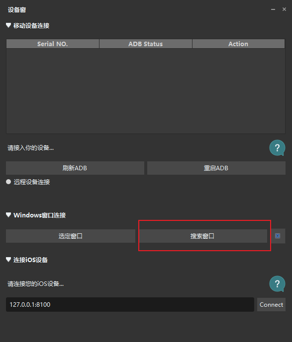
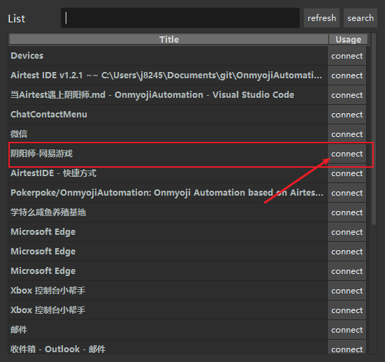
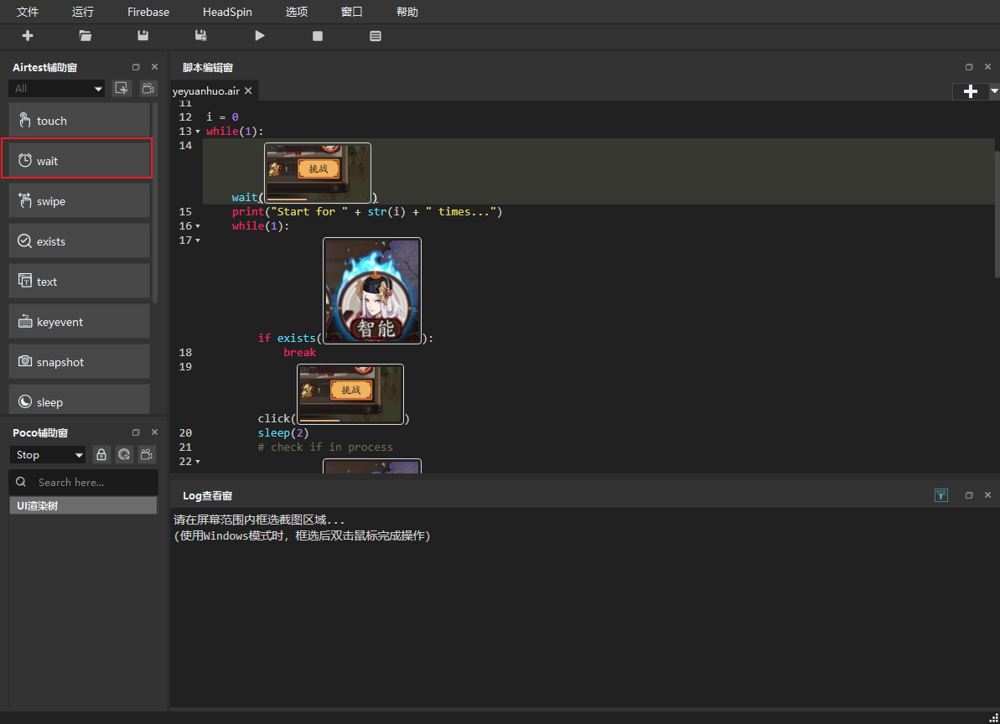
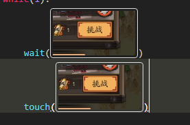

# 当Airtest遇上阴阳师

**仅供学习交流，后果自负。**

## 本文目的

刷光业原火，解放双手，节省樱饼，拯救小纸人。

## 项目地址

[OnmyojiAutomation](https://github.com/Pokerpoke/OnmyojiAutomation)

## 准备工作

- 安装[Airtest](http://airtest.netease.com/)
- 安装[阴阳师桌面版](https://yys.163.com/zmb/)

## 心路历程

阴阳师的副本流程都差不多，开始挑战->等待->红蛋奖励界面点击->开始挑战->等待->...，以此流程循环。

作为一名合格的程序员，这种机械的工作怎么能手动点？樱饼不够怎么办，手动肝是不可能的。

那我们操起Python这种大杀器吧，翻一翻Google，可以看到诸如这种的[阴阳师肝不动了，试试Python吧](https://zhuanlan.zhihu.com/p/25074274)。

几乎所有的方法都是CV+鼠标点击操作，那我们也得按照这个来，在细细一想这不就是自动化测试方法么，激励一番网上冲浪，找到了Airtest这个葵花宝典，还是网易出品的葵花宝典，嘿嘿，网易就是我大哥。

## 开工

### 1. 护肝第一步，打开阴阳师。emmm，和**管理员权限打开**Airtest。



选项->设置，勾选最上面三个选项。



### 2. 将Airtest连接阴阳师

点击设备窗->搜索窗口->阴阳师-网易游戏





### 3. 写代码

万事俱备，只欠东风。

点击wait，进入截图模式，截取阴阳师界面中的挑战按钮，截取范围可以稍大，提高识别率。



窗口中自动产生了，一行代码，我们选中该行代码，复制，将`wait`改为`click`或者`touch`，大概如下，此时按下F5或者点击上方的运行按钮（一个小三角），就可以看到鼠标自己跑过去点击挑战按钮了。



我们按照一开始的点击挑战->打架->等待结束即可，自己添加一些边界条件跟随机参数。

```python
# -*- encoding=utf8 -*-
__author__ = "j8245"

from airtest.core.api import *
import random

auto_setup(__file__)

# 挑战耗时，我是咸鱼，要一分半，根据需要自行调整
yeyuanhuo_duration = 105

i = 0
while (1):
    # 等待挑战按钮
    wait(Template(r"./img/challenge.png"))
    print("Start for " + str(i) + " times...")
    while (1):
        # 判断是否开始打架
        if exists(Template(r"./img/qingming.png")):
            break
        click(Template(r"./img/challenge.png"))
        sleep(2)
        # 正在打架
        if exists(Template(r"./img/qingming.png")):
            break
    # 打架
    sleep(yeyuanhuo_duration + random.randint(0, 5))
    # 等待结算的红蛋
    wait(Template(r"./img/red_egg.png"))
    sleep(2 + random.randint(0, 5))
    while(1):
        click(Template(r"./img/red_egg.png"))
        sleep(2 + random.randint(0, 5))
        # 判断点击成功没有
        if not exists(Template("./img/red_egg.png")):
            break
    print("Finish.")
    i += 1
```

如果不想折腾了，直接打开本项目中的`yeyuanhuo.air`项目即可。

### 4. 不足之处

- 需要阴阳师在前台，不然没法点击，不过可以左边浏览器刷知乎，右边刷阴阳师。
- 没法直接从命令行启动，经测试是相对坐标的问题，与Airtest有关，暂时无解。
- 需要根据不同配置手动设置时间。
